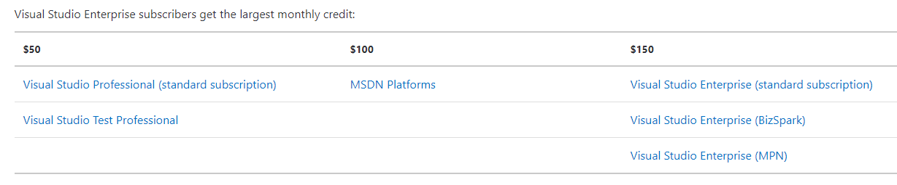
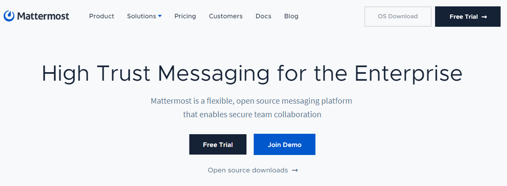
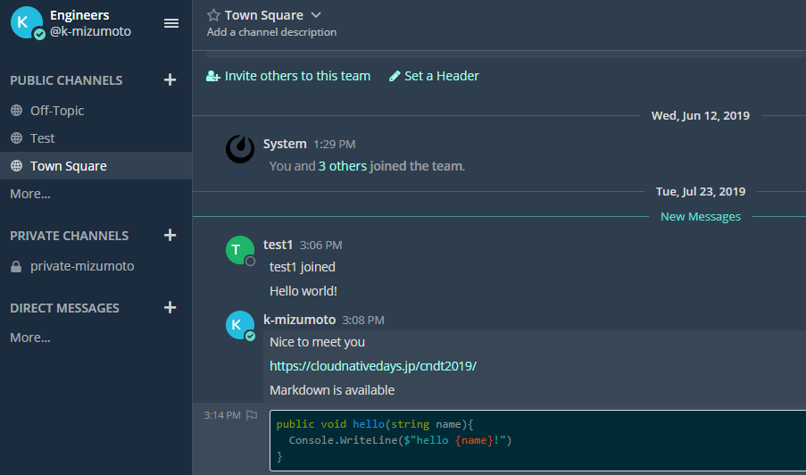

class: center, middle, blue
# Cluster Management on Azure

---
### whoami

.left-small[
    
]

.right-large[
- Kyohei Mizumoto(@kyohmizu)

- C# Software Engineer

- Interests
    - Docker/Kubernetes
    - Go
    - Security

- Studying kubernetes for half a year
]

---
### Motivation

- But I don't use kubernetes for work...

--

- So, I tried to create cluster by myself

---
class: header-margin
### Why AKS?

.zoom1[
<u><https://azure.microsoft.com/en-us/pricing/member-offers/credit-for-visual-studio-subscribers/></u>
]

<center></center>
<center></center>

---
### App

<u><https://mattermost.com/></u>

<center></center>

---
### App

<u><https://mattermost.com/></u>

<center></center>

---
### Configuration

.zoom1[
- Kubernetes Cluster(AKS)

  - App(Mattermost)

  - Prometheus

  - Grafana

  - Cert Manager
  
  - Fluent Bit

- Azure Load Balancer

- Azure Database for PostgreSQL server

- Azure Key Vault

- Azure Log Analytics
]

---
### Features

.zoom1[
- Monitoring

  - Prometheus + Grafana

- Logging

  - Fluent Bit + Azure Log Analytics

- TLS support

  - Cert Manager

- Secret management

  - Azure Key Vault
]

---
### IaC

- All services (but DB) are managed with terraform

  - azurerm_resource_group
  - azurerm_kubernetes_cluster
  - azurerm_key_vault
  - azurerm_key_vault_secret
  - azurerm_log_analytics_workspace

```bash
$ terraform apply
```

- Otheres are manifests

---
### Problems

.zoom1[
- Azure Key Vault doesn't support env variables  
<u><https://github.com/Azure/kubernetes-keyvault-flexvol/issues/28></u>  
  (How can I deploy legacy apps using env variables?)

- Secrets on Azure Key Vault (which were created with terraform) are now inaccessible from outside the cluster  
  (Something wrong with access policies)

- Metrics settings of prometheus and fluent bit are not enough  
]

---
### Next Step

I want to add:

- Continuous Delivery

  - Spinnaker, Argo CD, Tekton

- Service Mesh

  - Istio, SMI

---
### Source Code

<u><https://github.com/kyohmizu/mattermost-aks></u>

- Any ideas are appreciated!!


↑ You can join the mattermost team form above.

---
class: center, middle, blue
# Thank you!
